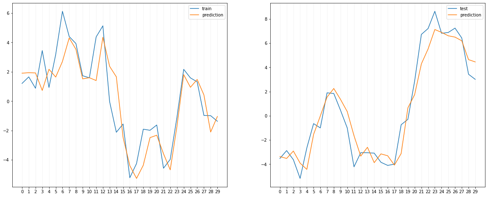
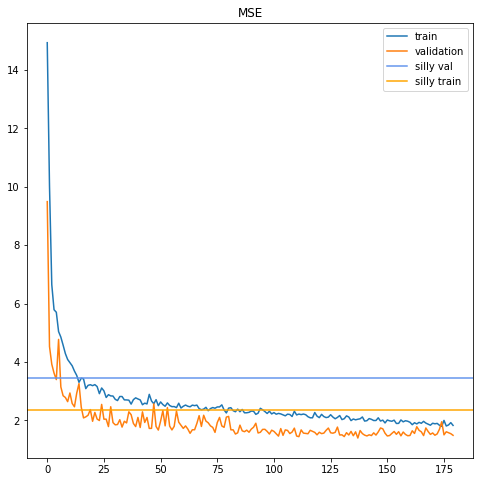

# ML_projects

This repository currently contains three short machine learning projects in python jupyter notebooks. 
The ML models where implemented using scikit-learn and keras.
The projects are:
- Iris_dataset: classifier models for the iris flower dataset. 
- Fashion-MNIST: Convolutional Neural Network classifier for the Fashion MNIST data set.
- LSTM_trade: Long Short-Term Memory model to predict 10-day return of HSBCA stocks.

## Iris_dataset

This notebook implements different ML models to classify iris flowers into three categories (species). The dataset contains 150 samples and 4 features. The implemented models are:
- SVM
- K-Nearest Neighbours 
- Neural Net

All three models achieve accuracies greater than 0.9. 
Additionally, a PCA was applied to reduce the dimensionality to 3, obtaining better-separated clusters.

## Fashion-MNIST

The Fashion-MNIST dataset is a benchmark dataset consisting of 70K 28x28 greyscale images of clothing items. 
The items are labelled into 9 categories. 

The selected model is a CNN with 7 hidden layers, containing convolutional, max pooling and dense layers.
The model accuracy on the validation set is slightly above 90%. This is a satisfactory result considering that the low resolution of the sample images makes the classification of some of the images difficult for humans. For example, some of the wrong predictions were:

The last part of the notebook uses the [Grad-CAM++](https://arxiv.org/pdf/1710.11063.pdf) method to interpret the model.
The result is a heatmap that represents the most significant regions of the images for the CNN classification.

# LSTM_trade

The goal of this project was to create an ML model to predict the 10-return of the HSBCA stocks, given the open/closing price and volume of a previous time interval.
The raw data, obtained from Yahoo Finance, is processed into different financial indicators using the TA-lib library. A total of 5 signals are selected as input for the model.
The selected model was an LSTM network, given its natural ability to capture correlations and model time series. 
The model contains three LSTM layers, two dropout layers and two dense layers (including the output layer).
The time window is 10 trading days.
The predictions successfully follow the trends both in the training and testing set. The following figure shows the real return vs prediction for a random segment of the training and test series.

A common pitfall of this type of stock prediction model is that sometimes the model learns to repeat the previous day's point, yielding a price curve offset by one day. 
If one plots the curves over a long time domain, both curves overlap giving the impression of a very robust prediction.
Our model, however, outperforms the silly copy-the-previous-day strategy. The following plot shows how the model performance improves the silly model both for training and test sets during training.

